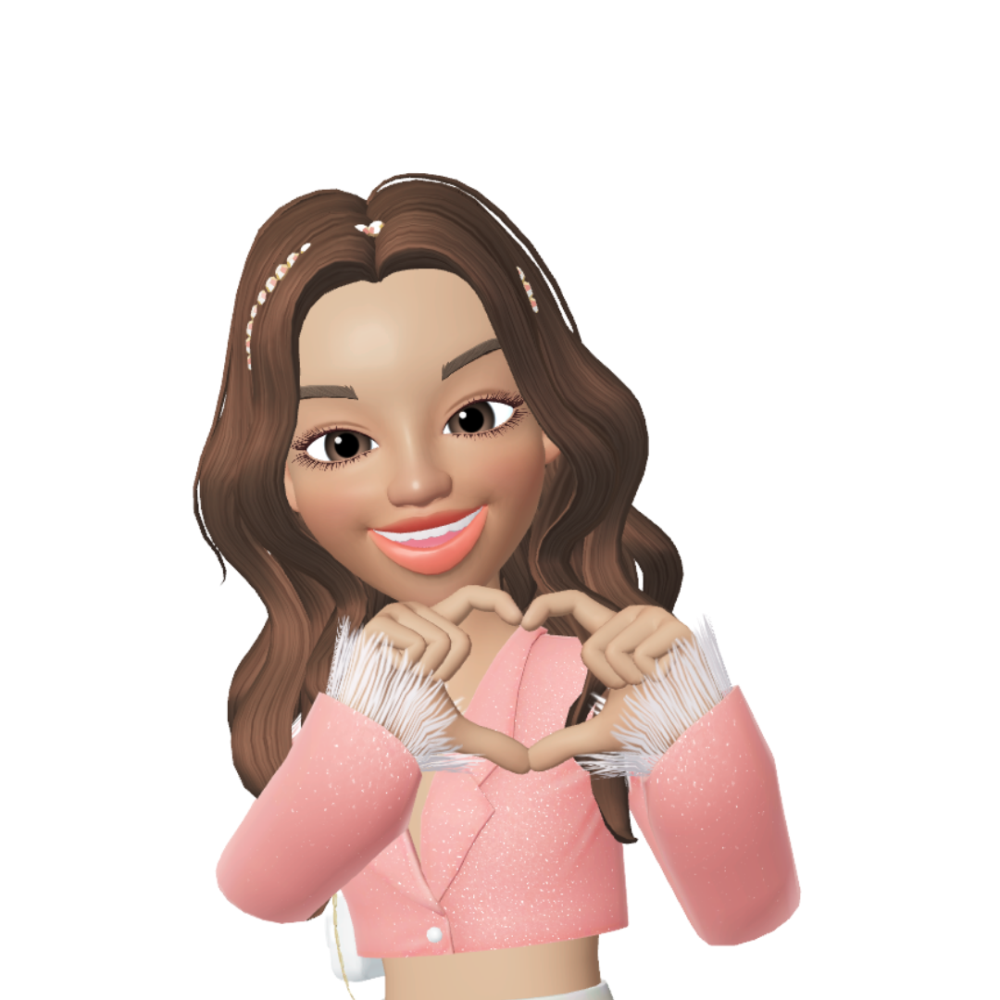

# Seja bem bem vindo

    <td></td>Meu nome é Thifany, tenho 22 anos e sou bahiana.

 ## Ferramentas e Tecnologias
 
       

 
         
          
Comecei a trabalhar aos 17 anos com atendimento ao público, meu primeiro trabalho foi em um estágio com operadora de caixa no qual fiquei mais de um ano. Depois disso sempre trabalhei com vendas no ramo alimentício, e assim foi por alguns anos da minha vida.

Até que mudei de cidade e comecei a trabalhar com alimentação para cães, como auxiliar de produção, dessa forma comecei a ter mais contato com outros animais além dos meus, e a entender um pouco sobre algumas raças.

Abri uma loja de ração e começei a trabalhar como autonoma por um tempo,um tempo depois fiz curso de banho e tosa e comecei a exercer a função mais ativamente até que percebi que estava insatisfeita com o meu trabalho. Finalizava o dia muito cansada tinha que lidar com os clientes incompreensivos que não entendia que cachorros de pelo longo exigem cuidados diários que vão alem de um dia da semana no petshop.

Eu sempre tive interesse pela área da programação, quando assim que ganhei o meu primeiro netbook do meu tio e comecei a utilizar blogs e pouco tempo depois já estava desenvolvendo layouts com tutoriais que vi pela internet, com isso aprendi um pouco de <b>html</b> , <b>Css</b> , <b>JavaScript</b> mas me afastei dessa área quando iniciei no mercado de trabalho.

Eu iniciei a faculdade de ánalise de sistemas, estudei também por site gratuitos e vídeos no youtube, sendo basicamente essas fontes do meu conhecimento.

Certo dia recebi uma notificação de notícias no meu celular, que falava a respeito do desafio do burgue king com a kenzie, aonde teria um curso introdutório e gratuito sobre programação, acabei me inscrevendo e surgiu a oferta se eu havia interesse em participar do processo seletivo da Kenzie.

Eu acessei o site e conferi todas as informações e logo depois falei com a minha mãe que super gostou da ideia e me icentivou a participar.

Me inscrevi e graças a Deus e com muita oraçao, passei e hoje sou aluna dessa incrivel escola e digo que estou realmente fazendo algo que eu sempre amei fazer.
Me sinto completamente realizada nessa profissão, é aquilo que eu nasci para ser.

  

  <a href="https://github.com/thifanysantos">
  
    
    

 
  
  
   
 

